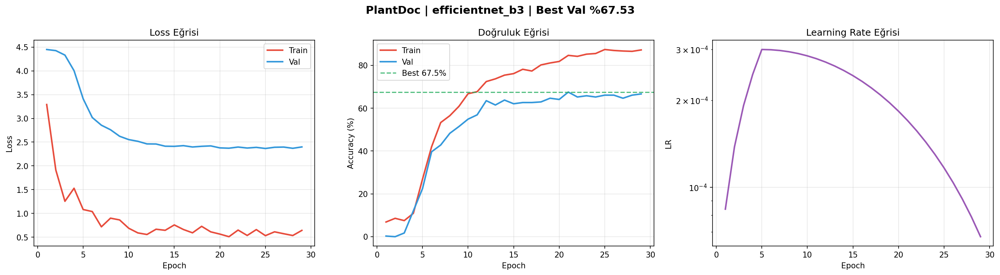
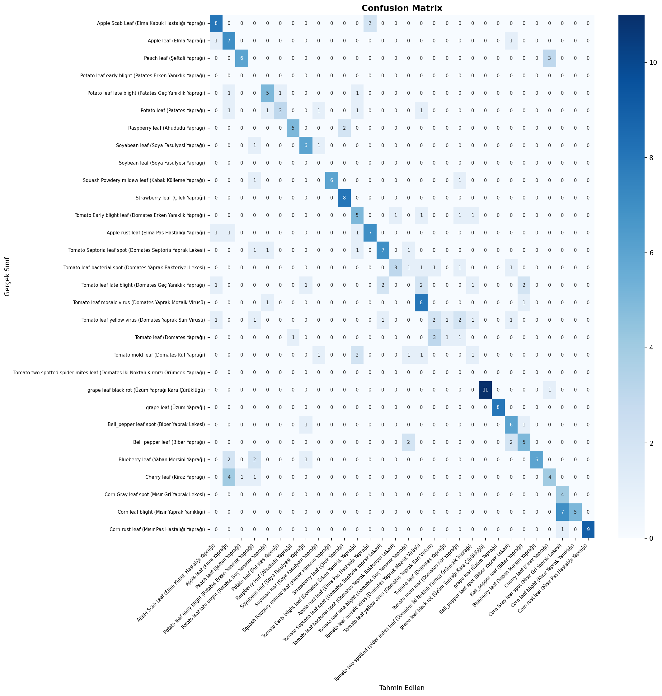
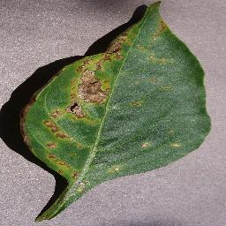

# Bitki Hastalığı Teşhisi: PlantDoc ve PlantVillage Veri Kümeleri
PlantVillage colab link: https://colab.research.google.com/drive/1mJoJKyPytvKsIe2DQ-IYkseezblqTlF4?usp=sharing

PlantDoc colab link    : https://colab.research.google.com/drive/1G0zyMs4xtJp8WKKJmOrdabOEuCsjv3w8?usp=sharing

Bu proje, çeşitli bitki hastalıklarını tespit etmek için derin öğrenme modellerini kullanmaktadır. İki ana veri kümesi üzerinde çalışılmıştır: PlantDoc ve PlantVillage. Her iki veri kümesi için de ayrı ayrı model geliştirme ve değerlendirme süreçleri aşağıda özetlenmiştir.

## 1. PlantDoc Veri Kümesi (İlk Çalışma)

🌿 PlantDoc: Bitki Hastalığı Sınıflandırma Sistemi
Bu proje, PlantDoc veri setini kullanarak bitki yapraklarındaki hastalıkları tespit etmek için geliştirilmiş, derin öğrenme tabanlı bir sınıflandırma modelidir.
🚀 Öne Çıkan Özellikler
Model Mimarisi: EfficientNet-B3 (Transfer Learning).
Hız: Mixed Precision (AMP) ile GPU optimizasyonu.
Yerelleştirme: 30 sınıf için Türkçe dil desteği.
📸 Örnek Veri (Dataset)
Eğitim setinden bir örnek (Patates Yaprağı):

📊 Görsel Sonuçlar
Eğitim Eğrileri

Karışıklık Matrisi

🎯 Tahmin Örneği
Modelin bu görsel üzerindeki sonucu:
Sınıf: Patates Yaprağı (Potato leaf)
Güven: %67.7

## 2. PlantVillage Veri Kümesi (Güncel Çalışma)

Bu bölümde, bitki hastalıklarını sınıflandırmak için yaygın olarak kullanılan PlantVillage veri kümesi üzerinde yapılan çalışmalar detaylandırılmıştır. Veri kümesi, farklı bitki türlerinin sağlıklı ve hastalıklı yaprak görsellerini içerir ve her sınıf, dizin yapıları aracılığıyla tanımlanmıştır.

### 2.1. Veri Hazırlığı ve Özelleştirme

PlantVillage veri kümesi, sınıf etiketlerini ayrı `.txt` dosyalarında tutmak yerine, resimlerin bulunduğu dizin adlarını kullanarak tanımlamaktadır. Bu yapıya uyum sağlamak için, mevcut veri yükleme betiği aşağıdaki şekillerde adapte edilmiştir:

*   **Veri Kök Dizini Ayarlaması**: Resimlerin gerçek kök dizini olan `./plantvillage_data/plantvillage/PlantVillage` yoluna işaret edecek şekilde `data_root` değişkeni güncellendi.
*   **Sınıf İsimlerinin Çıkarılması**: Sınıf isimleri, doğrudan bu kök dizin altındaki klasör adlarından otomatik olarak çıkarıldı.
*   **Özel `PlantDocDataset` Sınıfı**: `PlantDocDataset` sınıfı, dizin tabanlı sınıflandırma yapısına uygun olarak yeniden yazılarak, her bir sınıf klasöründeki görselleri ve bunlara karşılık gelen dizin adından türetilen sayısal etiketleri toplar hale getirildi.
*   **Veri Bölümleme**: Veri kümesi, eğitim, doğrulama ve test setlerine ayrılırken `random_split` ve `TransformedSubset` kullanılarak sağlam bir bölümleme sağlandı.

### 2.2. Model Eğitimi ve Sonuçları

Model, EfficientNet-B3 mimarisi kullanılarak eğitilmiştir. Eğitim süreci boyunca karışık hassasiyet (mixed precision) ve öğrenme oranı planlaması (learning rate scheduling) gibi teknikler kullanılmıştır. Erken durdurma (early stopping) mekanizması ile en iyi performans gösteren model kaydedilmiştir.

*   **En İyi Doğrulama Başarımı**: %99.61 (19. Epoch)
*   **Test Doğruluğu**: %99.52

#### Eğitim Eğrileri

Eğitim ve doğrulama kayıp ve doğruluk oranlarını ile öğrenme oranı değişimini gösteren grafikler aşağıdadır:


#### Karmaşıklık Matrisi (Confusion Matrix)

Modelin test seti üzerindeki performansını detaylandıran karmaşıklık matrisi:


### 2.3. Görsel Tahmin Örneği




Eğitilen model, tekil görseller üzerinde tahmin yapmak için de kullanılabilmektedir. Aşağıda, `Pepper__bell___Bacterial_spot` sınıfına ait bir görsel için yapılan tahmin örneği ve sonuçları yer almaktadır:

```
🌿  Tahmin: /content/plantvillage_data/plantvillage/PlantVillage/Pepper__bell___Bacterial_spot/0022d6b7-d47c-4ee2-ae9a-392a53f48647___JR_B.Spot 8964.JPG
────────────────────────────────────────────────────
  Pepper__bell___Bacterial_spot          ████████████████████████████  95.0%
  Potato___healthy                          2.0%
  Tomato__Tomato_mosaic_virus               0.7%
  Tomato_Early_blight                       0.5%
  Potato___Late_blight                      0.3%

  → Sonuç: Pepper__bell___Bacterial_spot  (%95.0)
```

Bu çalışma, PlantVillage veri kümesiyle bitki hastalıklarının yüksek doğrulukla teşhis edilebileceğini göstermektedir. Elde edilen model, bitki hastalıklarının erken tespiti ve yönetimi konusunda önemli bir potansiyele sahiptir.
